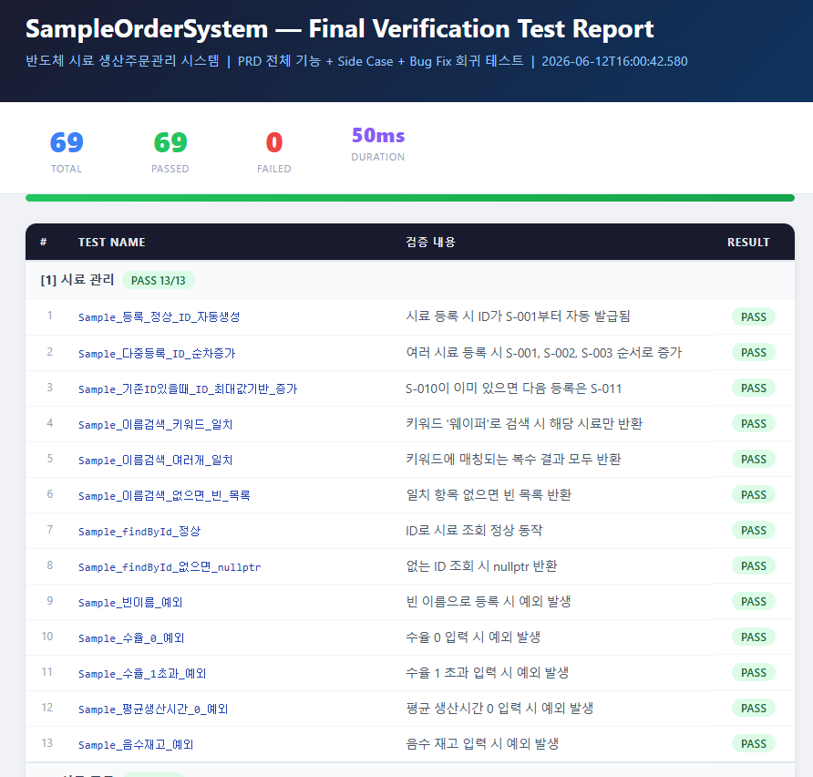
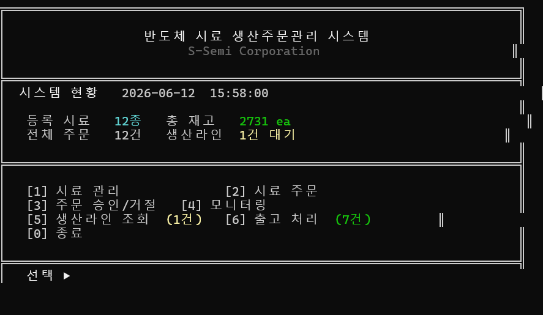
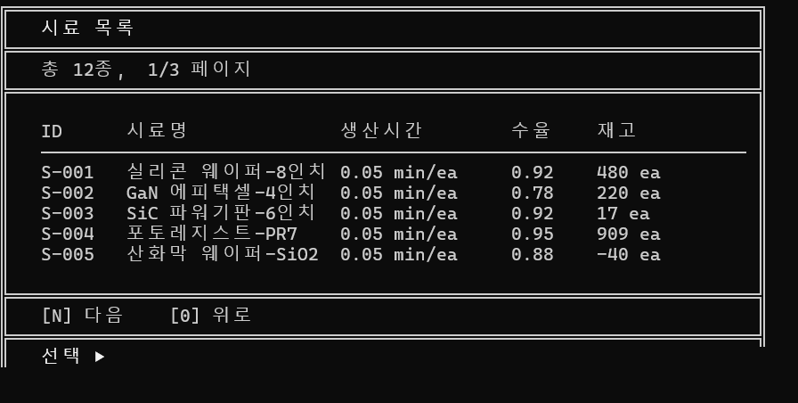
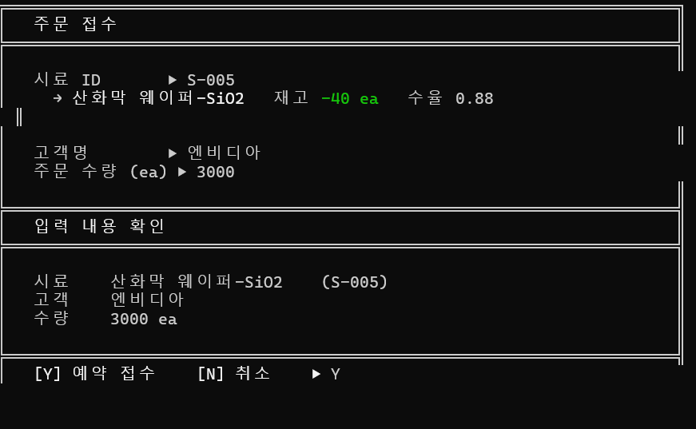
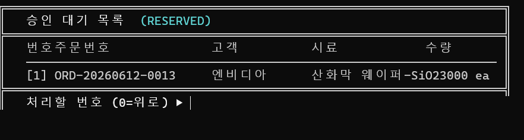
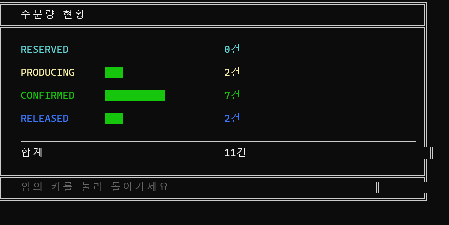
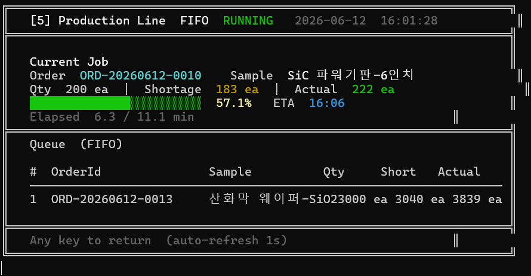
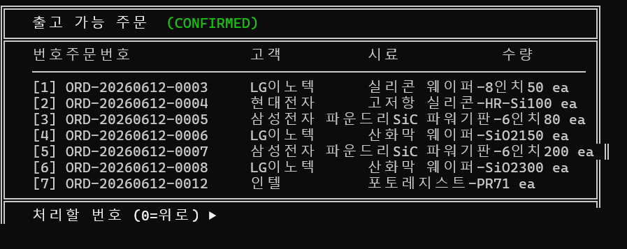

# SampleOrderSystem

반도체 시료 생산주문 관리 시스템 — Windows 콘솔 기반 **C++17 MVC** 애플리케이션.

> **문서 바로가기**: [CLAUDE.md](CLAUDE.md) · [PRD.md](PRD.md)

---

## Final Verify — 전체 테스트 완료

PRD.md 전체 기능을 커버하는 **Final Verify Test (69개)** 를 포함해 총 **155개 테스트** 전체 통과.

| 항목 | 링크 |
|------|------|
| HTML 테스트 리포트 | [test_final_verify_report.html](test_final_verify_report.html) |
| 테스트 통과 스크린샷 |  |

---

## UI 화면

| | |
|---|---|
|  |  |
| **[1] 메인 메뉴** | **[2] 시료 관리** |
|  |  |
| **[3] 시료 주문** | **[4] 주문 승인/거절** |
|  |  |
| **[5] 모니터링** | **[6] 생산라인 조회** |
|  | |
| **[7] 출고 처리** | |

---

## Phase별 테스트 커버리지

| Phase | 대상 | 테스트 수 | 상태 |
|-------|------|-----------|------|
| Phase 0 | Google Test 환경 통합 확인 | 1 | PASS |
| Phase 1 | JsonRepository — JSON 직렬화/역직렬화, 저장·로드 | 7 | PASS |
| Phase 2 | SampleService — 시료 등록·조회·검색·유효성 | 12 | PASS |
| Phase 3 | OrderService — 주문 생성, 번호 형식, 중복 방지 | 9 | PASS |
| Phase 4 | ApprovalService — 재고 기반 승인/거절, 생산 큐 | 15 | PASS |
| Phase 5 | ProductionService — FIFO 완료, 재고 정산 | 15 | PASS |
| Phase 6 | ReleaseService — 출고 처리 | 11 | PASS |
| Phase 7 | MonitorService — 주문 현황, 재고 상태 | 16 | PASS |
| Phase 8 | 전체 통합 플로우 | 6 | PASS |
| **Final Verify** | **PRD 전체 기능 + 버그픽스 회귀 + Side Case** | **69** | **PASS** |
| | **합계** | **161** | **전체 PASS** |

---

## 폴더 구조

```
SampleOrderSystem/
├── src/
│   ├── model/          도메인 모델 (Sample, Order, ProductionEntry 등)
│   ├── repository/     JSON 영속성 (JsonRepository)
│   ├── service/        비즈니스 로직 (SampleService, OrderService, ApprovalService,
│   │                                   ProductionService, ReleaseService, MonitorService)
│   └── view/           콘솔 UI — MVC View 계층
├── tests/              Google Test 기반 단위·통합 테스트
│   ├── test_phase0.cpp ~ test_phase8.cpp
│   └── test_final_verify.cpp   (Phase 무관 PRD 전체 검증)
├── db/                 런타임 JSON 데이터 (orders.json, samples.json, …)
├── docs/               기능 설계 문서 (system-overview, order-status, features/*)
├── include/nlohmann/   nlohmann/json v3.11.3 (빌드 시 자동 다운로드)
├── googletest/         Google Test v1.14.0 (빌드 시 자동 다운로드)
├── build.bat           메인 빌드 스크립트
├── _run_fv.bat         Final Verify 테스트 전용 빌드·실행 스크립트
├── CLAUDE.md           프로젝트 규칙 및 하네스 정책
└── PRD.md              제품 요구사항 문서 (기능 명세)
```

---

## 빌드 및 실행

**요구 환경**: Windows 10/11, Visual Studio 2022 (C++ 빌드 도구 포함)

### 앱 빌드

```bat
build.bat
```

첫 실행 시 `nlohmann/json` 헤더를 자동 다운로드합니다.

### 빌드 + Phase 0~8 전체 테스트

```bat
build.bat --test
```

Google Test 라이브러리를 자동 다운로드 후 빌드, Phase 0~8 테스트를 순차 실행합니다.

### Final Verify 테스트 (PRD 전체 검증)

```bat
_run_fv.bat
```

`test_final_verify.exe` 를 빌드하고 실행하며, `test_final_verify.xml` 결과 파일을 생성합니다.

### 앱 실행

```bat
SampleOrderSystem.exe
```

---

## 주요 기능

| 메뉴 | 설명 |
|------|------|
| [1] 시료 관리 | 시료 등록·조회·검색 |
| [2] 시료 주문 | 주문 생성 (RESERVED 상태) |
| [3] 주문 승인/거절 | RESERVED → CONFIRMED(재고 충분) / PRODUCING(재고 부족) / REJECTED |
| [4] 모니터링 | 주문 현황 및 시료별 재고 상태 요약 |
| [5] 생산라인 조회 | FIFO 생산 큐 라이브 현황, 자동 완료 처리 |
| [6] 출고 처리 | CONFIRMED → RELEASED |
